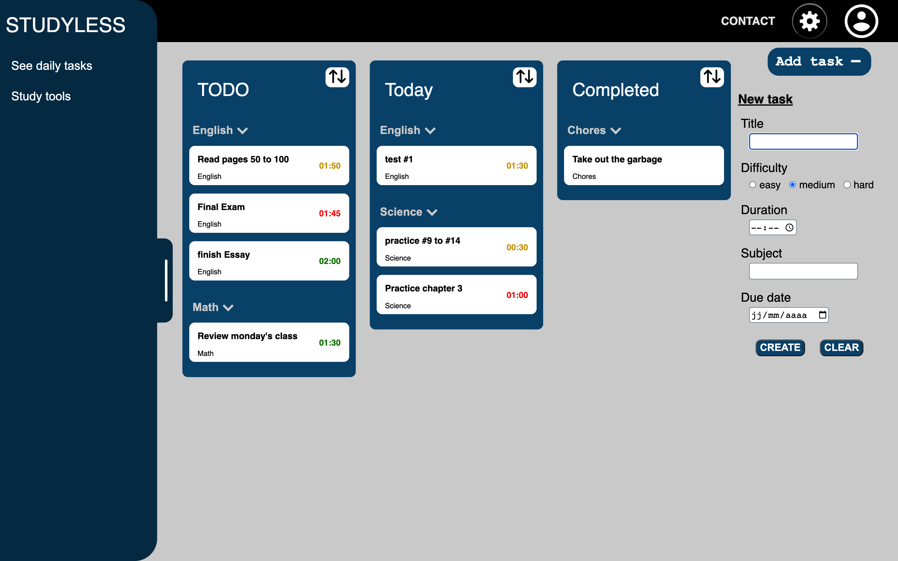
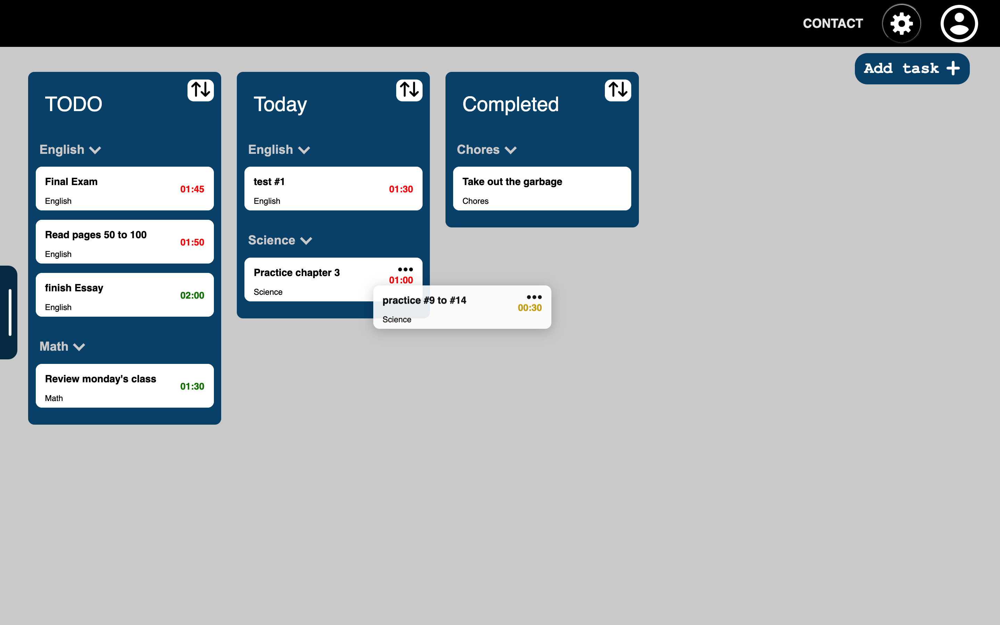
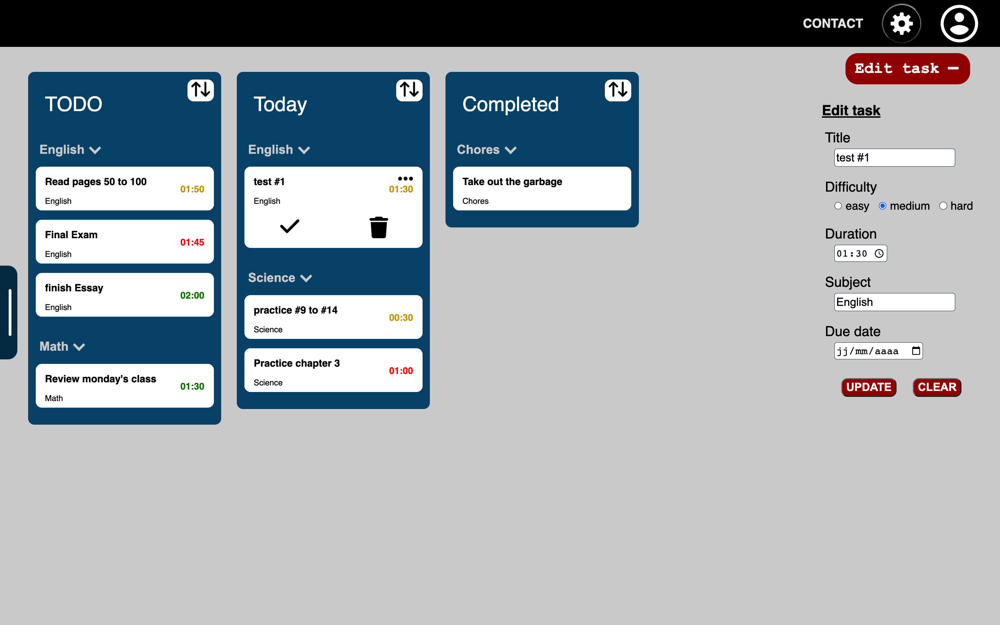
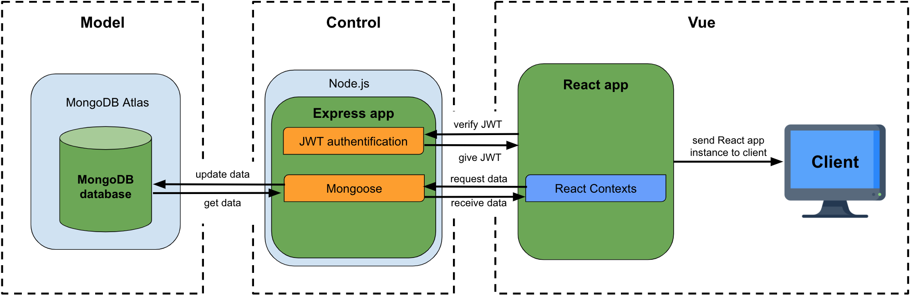

# StudyLess - Studyaid web app

> ## Note: This repository is only for demonstration purposes 
> To learn more about this project, please contact me with the link in the [Contact](#contact-info) section

## Table of contents

1. [Introduction](#introduction)  
1.1 [demo](#video-demo)  

2. [Functionnalities](#features)  
2.1 [Task manager](#manage-your-daily-tasks)  
2.2 [Timer](#breakdown-your-time)

3. [Architecture](#project-architecture)

4. [Contact]

# Introduction

The goal of this project is to create a website that help students simplify and optimise their studying schedule. This project is ongoing and will receive new features as time goes on.

## Video Demo

# Features

## Manage your daily tasks

By using the student oriented task form, your tasks can now be sorted in a meaningful manner.

### Drag & Drop

The tasks can also be dragged from one list to another to help the user visually organise their tasks.

### Edit tasks

In the event of a mistake or change in plans, tasks can also be modified, marked as completed or event deleted by opening up the task editor (three dots when hovering over a task).

## Breakdown your time

By using the timer, users can cycle through different work cycles including studying (25min), small break (5min) & longer break (15min). 

This time seperation technique is called Pomodoro & it's goal is to optimise focus & productivity when studying by integrating multiple small breaks in your study sessions.

# Project architecture
This project uses the popular MERN stack group of technologies. This includes MongoDB for the persistance layer, Node.js using the Express.js framework for the backend application & React.js for the frontend application (rendered and updated on the client's machine).

As you can see, this architecure is following the Model-Vue-Control(MVC) structure commonly seen in many fullstack applications.

## Contact Info
- [LinkedIn](https://www.linkedin.com/in/s%C3%A9bastien-roy-611245213/)
