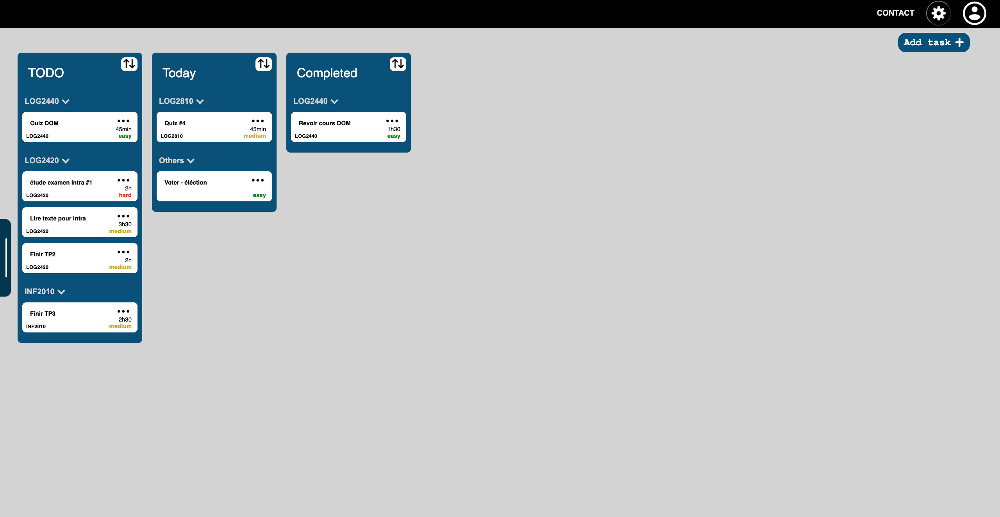

# Introduction

## Personal study assistant - Website

The goal of this project is to create a website that help students simplify and optimise their studying schedule. This project is ongoing and will receive new features as time goes on.

## Manage your daily tasks

By using the student oriented task form, your tasks can now be sorted by subject & difficulty. The tasks can also be dragged from one list to another & help the user visually organise their tasks.

## Keep track of time while studying

By using the study timer, users can cycle through different work cycles including studying (25min), small break (5min) & longer break (15min). This time seperation technique is called Pomodoro.

# QuickStart guide

Reminder if you pull this project!

If you pull this project and want to run it, here are some instructions :

1. git clone this repository into a local folder on you computer
2. execute the command "npm install" in the "frontend" and "backend" folders seperatly
3. host a mongodb server on your computer to give this app access to a mongodb server
4. In the global application folder, try "npm run startBackend" and follow the messages to set up the backend environment variables in a ".env" file located in the "backend" folder
5. In the global application folder, use "npm run startBackend" in a first terminal and "npm run startFront" in a second seperate terminal
6. enjoy!

Also, make sure you have downloaded the necessary software which includes :

- mongodb (community version 5 or more) (https://www.mongodb.com/try/download/community)
- node.js (https://nodejs.org/fr/download/)

# In Development

- Finish task menu for modifying individual task information
- Findign a name for the project (currently PolyStudy)
- schedule page
- task complete button animation (possibility)

## functionnalities to implement

- sort tasks by due date & duration
- Schedule planner

## Study tools to implement

- post-it notes
- flash cards study tool
